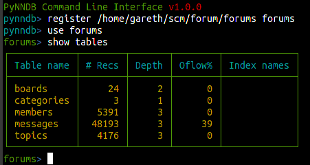
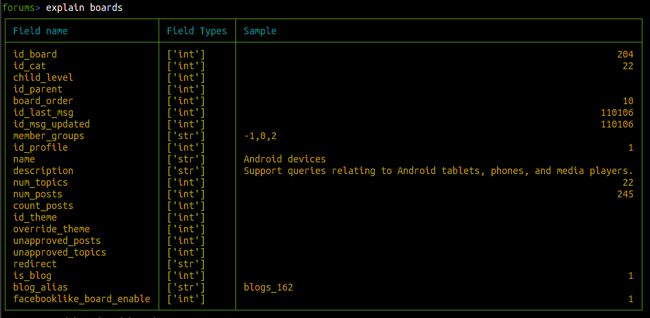
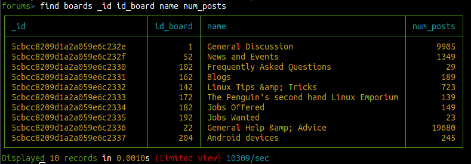
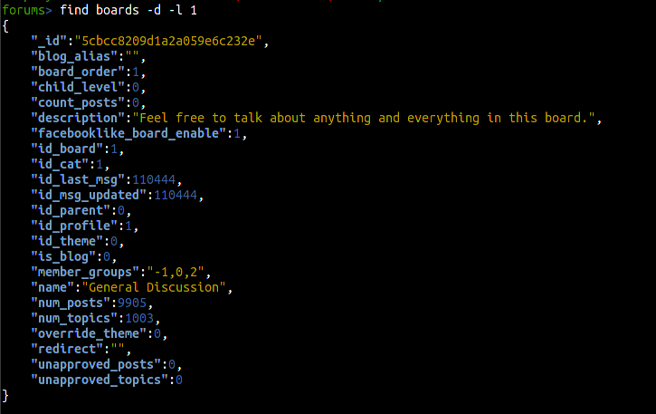
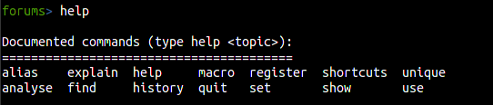
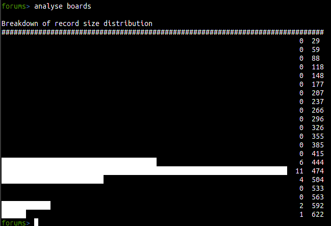

# How to use the CLI

First you will need to register your database with the shell, this is done by creating a link to your
DB files in ~/.pynndb/registered and goes like this.





In this case I'm using an import of a MySQL based SMF forum database, just to get some data to play with. So, next lets
have a look at the structure of the data in one of the tables. Because this is JSON there is no schema as-such, but typically
rows have relatively consistent attributes, so we read a sample of the database and list the most common fields.




Next, let's list some records from that table, by default we're limited to 10 records, but you can change with with;
```
set limit <n>
```
So to recover records, it's "find table {fields}", not that auto-complete should be available on pretty mush everything.





If you want the whole story, you can dump records by adding "-d", which will show the expanded JSON rather than a pretty
printed table. You can get more information with "help" from the command prompt.





Other useful commands can be found via "help", in particular;
```
show databases
show tables
explain <table>
find <table> {fields}
analyse <table>
```




Analyse table is useful for seeing the distributoin of records in terms of size, it attempts to print a histogram and count
of records falling into different size groupings.


